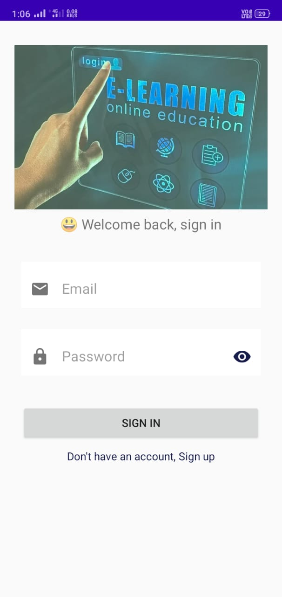
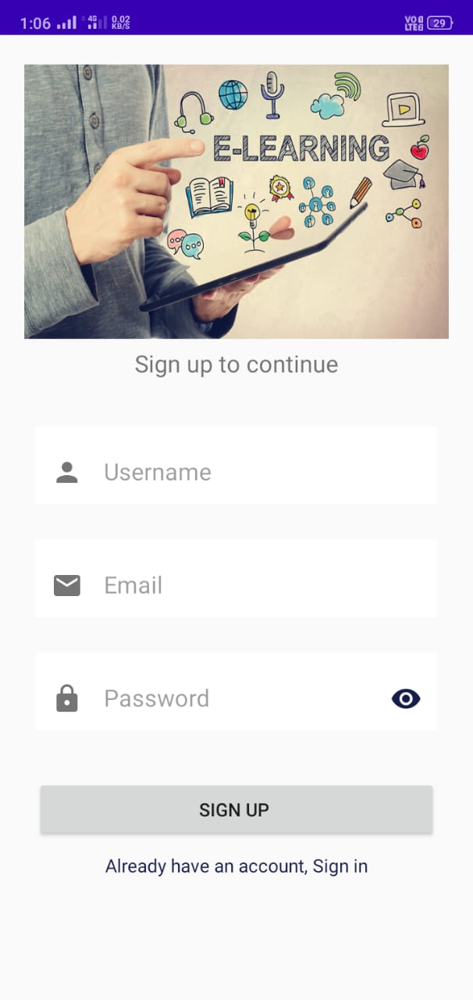
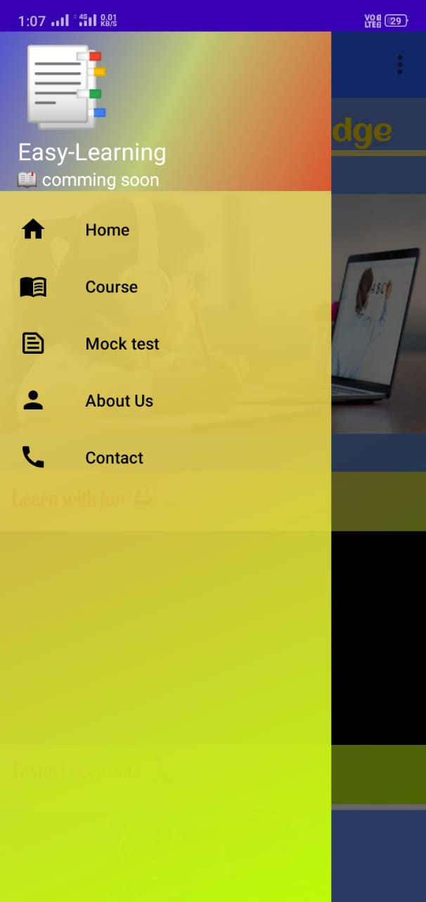
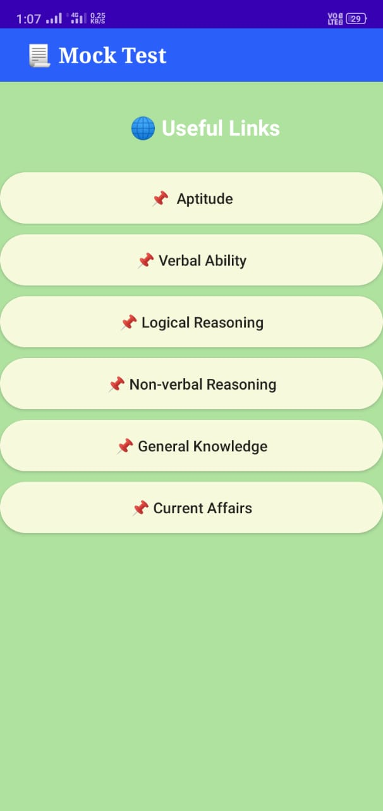

# Edu-help

App which shows information and resources available for students to learn and grow their skills.
This app as a Summer project before starting of my third year of BTech CSE.

## 📌 Features

- Login & Sign-up
- Provide free resources

## 📌 Demo

### Home Page

<div style="display: flex; margin: 1rem; justify-content: space-around; flex-wrap: wrap">
 
 
 <!--  -->
 
 
 <!--  -->
</div>

## Requirements

- jdk11
- Android Studio

## 📌 Get Started

```
git clone https://github.com/sankan401/edu-help.git
```

## 📌 View demo on a mobile device or a virtual emulator

- Make sure you have **Android SDK and Android Studio** installed.
- Open Android Studio and select Open /android folder in Android Studio project.
- Use the Run menu to either run or debug the application.
- Select your mobile or virtual (emulated) device
- Use the app.

## Building

Using Android Studio is the preferred way to build the project. To build form the command line, you can run

```
    ./gradlew assembleDebug
```

## Tech Stack

- Written in Java Programming Language.
- IDE : Android Studio
- No database used.
- Login with firebase

## 📌 Contributing

Fork the repository and make changes as you'd like. Pull requests are warmly welcome.
